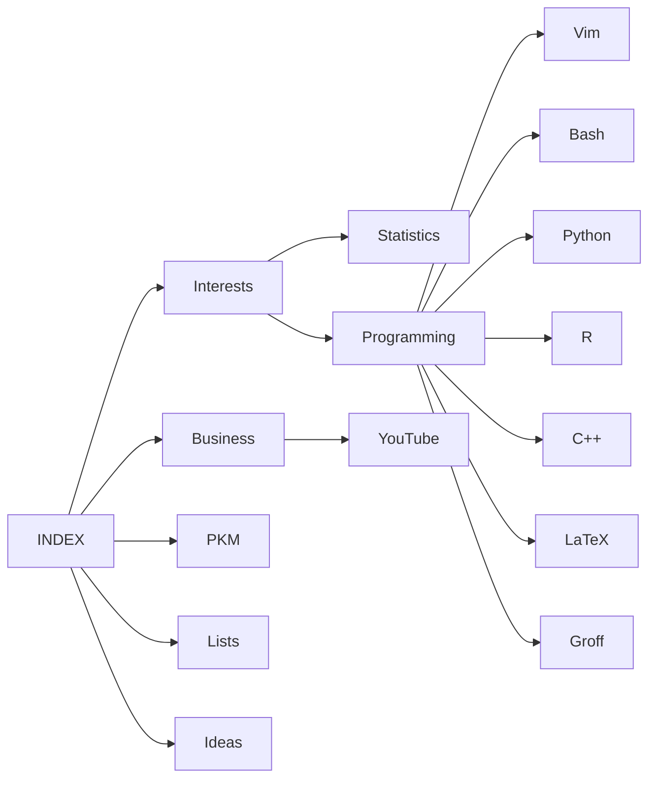

### Emerging Structure

> See [[INDEX#Purpose|Purpose]]

- [[INDEX]]

---
 ### Purpose 
 > The current purpose of this vault is to reinforce learning and knowledge:
 > - books
 > - ideas
 > - web development  
Through Zettelkastan system where each zettel is a note with unique id, and linked with each other. Each note will be written in my own words, connect, branch out and grow over time.

The 🐛 should be examined and extracted into separate concept 🔖 / common debug / tricks tips cards. 

> ###### Consistancy:
> The tag system and taxonomy will be refined as this system is getting built up.

> ###### Feynman Technique
> -   Try teach, explain, discuss the concept to a child
> -   Simple terms
> -   analogies
> -   Draw diagrams
> -   Compare, Contrast, Apply

> ###### Qs using Feynman Techniques
> - Q: What are the simple <mark>analogies</mark> to this concept?
> - Q: What does the relationship diagram look like?
> - Q: What are some ==applications==? How are they applied/ used? Constraint? Pros/Cons?
> - Q: What are some similar structures? similarities/ differences?
---

![[🧠️ Top of Mind]]

---

#### Tag Definitions & Groupings

- #🎨 ==CSS | any cool CSS snippets or CSS learnings==
- #🔖==Concepts==
- #🛠 ==Patterns/Implementation==

##### Note Status
- #📥️ ==Seed box | items that i am / will be actively working on==
- #🌱️ ==Seedlings | distilled from literature notes==
- #🌞️ ==Incubator | items not yet ready for planting or in need of planting==
- #🌲️ ==Evergreen | forest notes==
<br>

- #✅️ ==Items that have tasks that i need to complete==
- #🗺️ ==Maps of Content (the emerging organizational structure)==
- #⚙️ ==General utilities i use in this system==
	- [[✏️ Workbench]]
	- [[♻️ Flows]]
	- [[🔌️ Plugins]]
	- [[🛑 Thinking About That]]
- #❗️ ==IMPORTANT==
- #🏷️ ==Tag Notes==
	- [[🔗️☁️]] 

### Types of Content

- `@`: Person 
<br>
- `{`: Books, eBooks, or Audio Books, podcasts, youtubes 
- `?`: Insights, Ideas, Thoughts
- `!`: Tips and Tricks
- `%`: 
- `+`: 
- `(`: Web Articles or Publications, Newspapers, etc.
- `&`: Research Paper
- `-`: ^thisisatest

#### Simple Drawing Creation

https://excalidraw.com/

###### Build Index of Links & Counts

```bash
egrep -ohsr --exclude-dir='.*' "\[\[[A-Za-z0-9 _@ÄÖÜäöüß\'\!\?\.\(\)\-]+\]\]" -- * | sed -e 's/[[:space:]]#/#/' | sort | uniq -c | sort -r -t# -k2  > "🔗️☁️.md"
```


## The MAP of MOC


